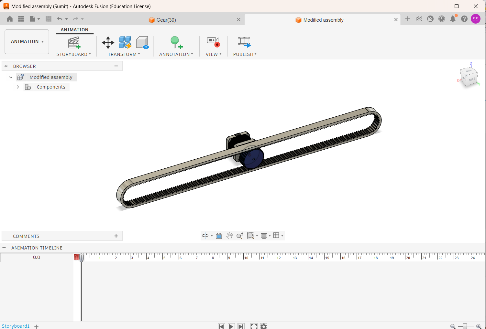
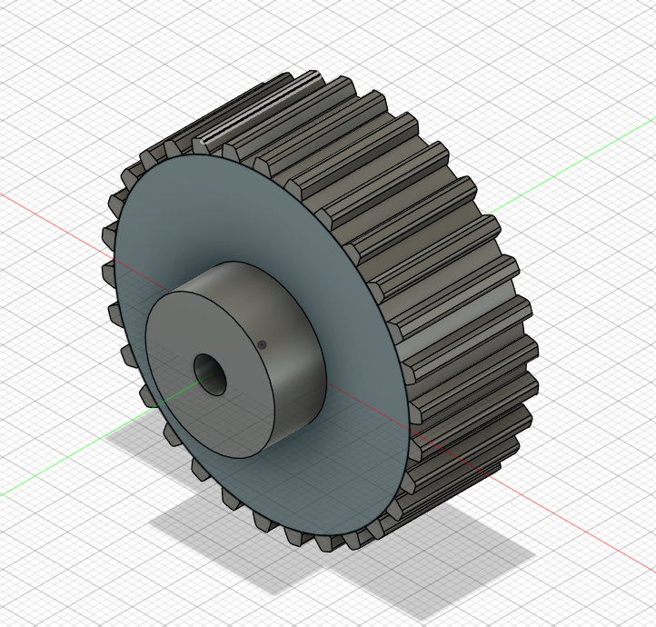
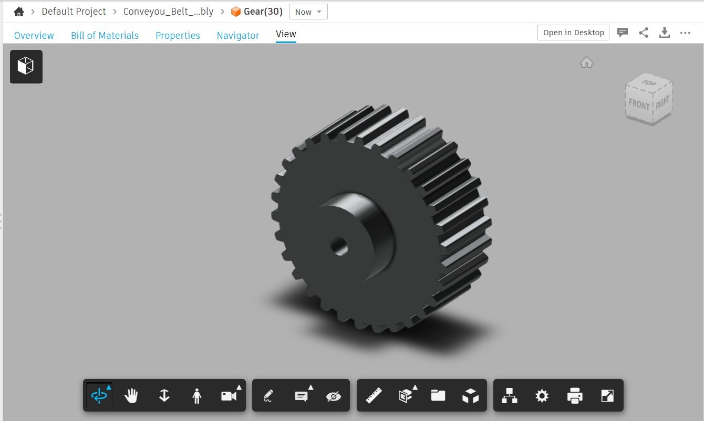
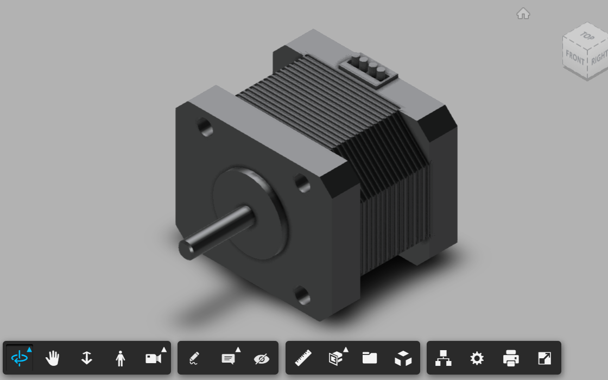
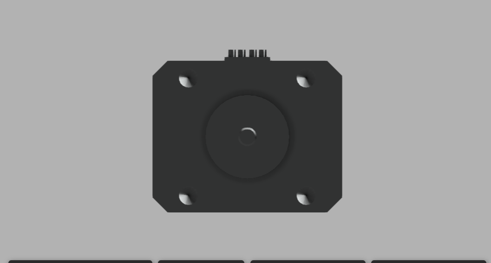
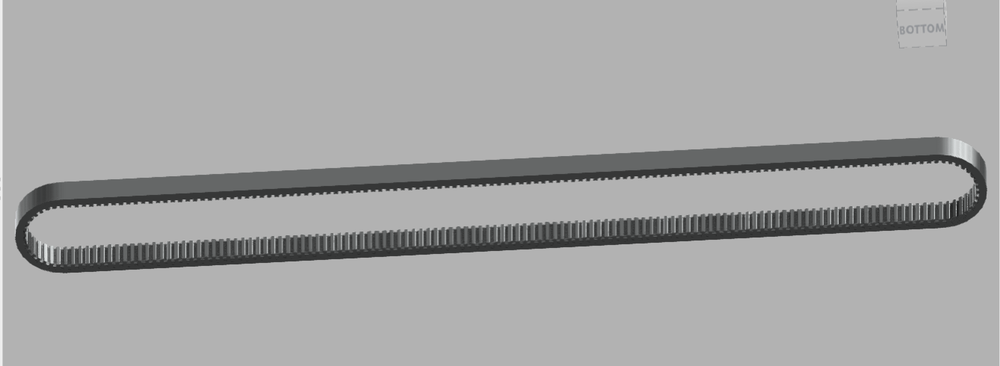
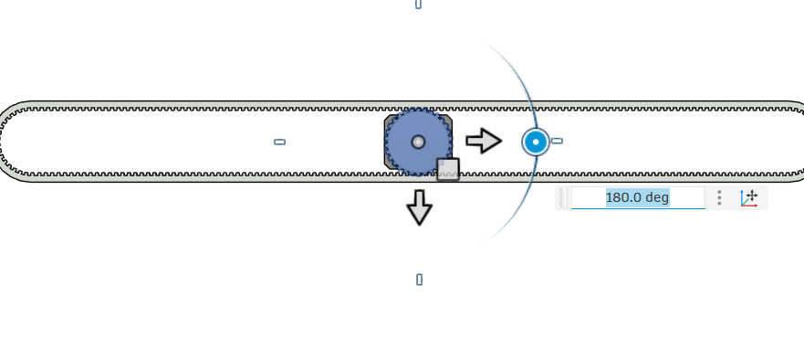
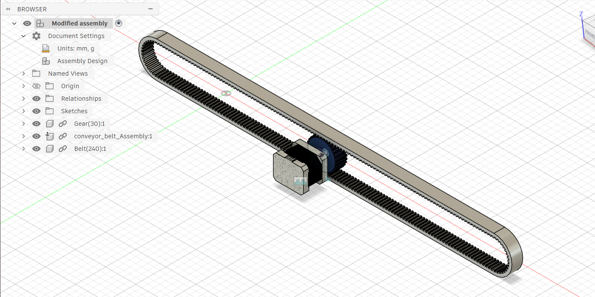

# Conveyor Belt Prototype

A single-stage conveyor belt mechanism designed in Fusion 360 — driven by a 30-tooth gear coupled to a stepper motor, running a toothed belt loop.

## Components

- **1x Gear** — 30-tooth pulley/gear, bored for a stepper motor shaft
- **1x Belt** — toothed (timing-belt style) loop running the full length of the conveyor frame
- **1x Stepper Motor** — drives the gear directly, mounted via a bracket at one end of the frame; 4-hole mounting face with connector pins for phase wiring

## Assembly



The gear sits on the stepper motor's shaft at one end of the frame; the belt wraps around the gear and an idler at the opposite end, forming a closed loop along the frame's length.

## Gear Detail




## Stepper Motor




## Belt Detail



## Joint Configuration

The belt-to-gear relationship was configured as a driven joint in Fusion 360, tested through a full rotation range (0°–180° shown below) before animating the assembly.



## Component Browser



Structure: `Gear(30):1`, `conveyor_belt_Assembly:1`, `Belt(240):1` — named and linked as separate components for independent editing.

## Repo Structure

```
cad-exports/    Native Fusion 360 files (.f3z assembly, .f3d gear component)
                plus Stepper_motor.step (standalone motor component)
media/          Renders, joint configuration, and browser tree screenshots
```

## Status

Early-stage prototype — single gear/belt/motor stage modeled and animated in Fusion 360. Physical build and control logic not yet started.

## Future Work

- Physical build and stepper motor driver wiring
- Multi-stage conveyor (additional gear/belt sections)
- Speed/position control via microcontroller
